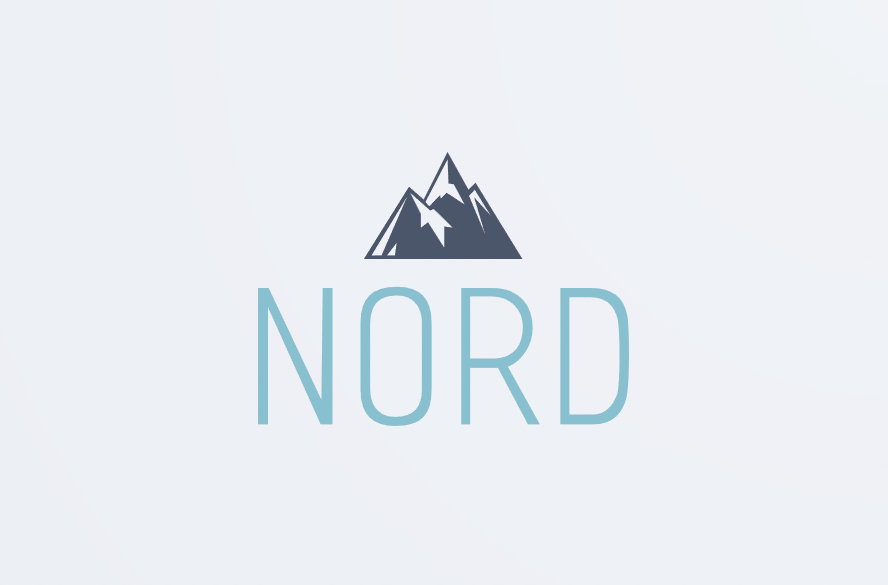
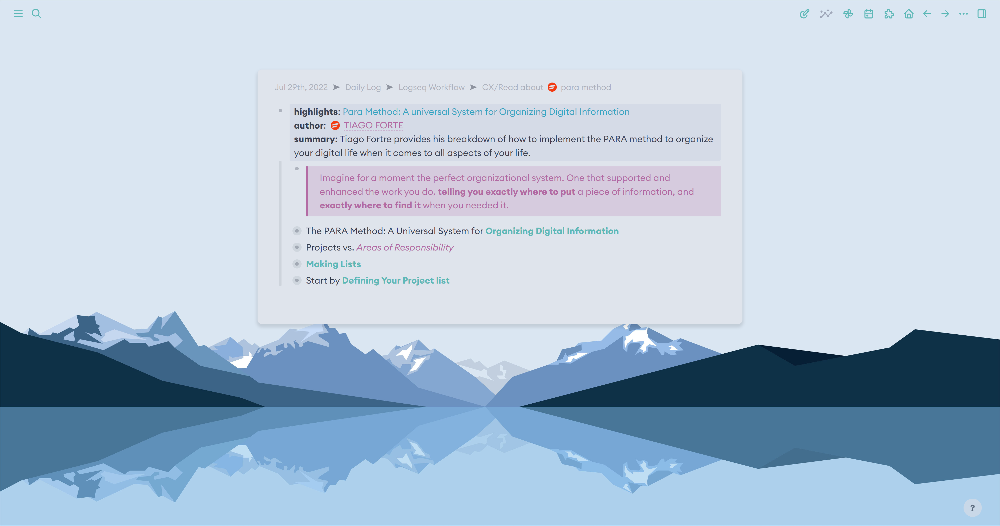
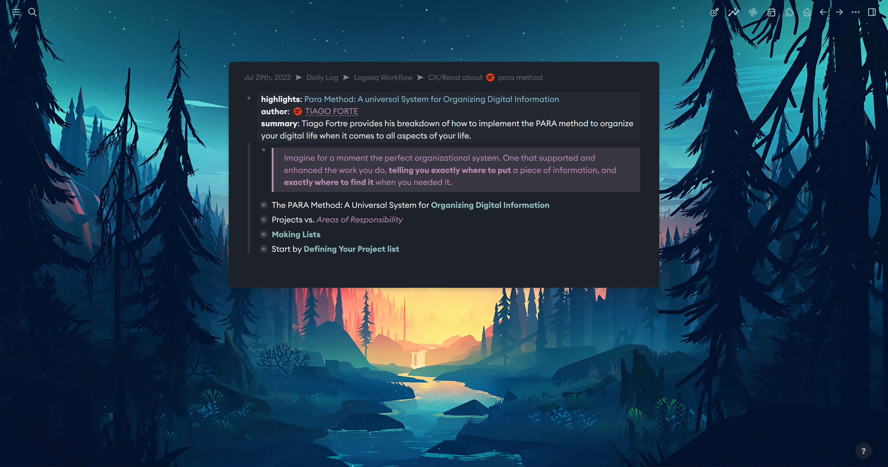

# Logseq Nord



- **Contributors:** Nick Martin (nmartin84)
- **Requires at least:** Logseq 0.8.1
- **Tested up to:** Logseq 0.8.1

  

  


## Description

NORD Theme for Logseq uses a new simplified CSS stylesheet to make configuration simple and easy. You can add the following section below and tweak the values to adjust the colors of the theme.
```css
.dark-theme,
html[data-theme='dark'] {
    --bg-url: url(https://images.unsplash.com/photo-1473654729523-203e25dfda10?ixlib=rb-1.2.1&ixid=MnwxMjA3fDB8MHxwaG90by1wYWdlfHx8fGVufDB8fHx8&auto=format&fit=crop&w=2670&q=80);
    --background-color-h: 220;
    --background-color-s: 16%;
    --background-color-l: 14%;
    --primary-color-h: 193;
    --primary-color-s: 43%;
    --primary-color-l: 67%;
    --secondary-color-h: 179;
    --secondary-color-s: 25%;
    --secondary-color-l: 65%;
    --accent-color-h: 311;
    --accent-color-s: 20%;
    --accent-color-l: 63%;
    --primary-text-h: 218;
    --primary-text-s: 27%;
    --primary-text-l: 94%;
}

.white-theme,
html[data-theme='light'] {
    --bg-url: url(https://images.unsplash.com/photo-1504829857797-ddff29c27927?ixlib=rb-1.2.1&ixid=MnwxMjA3fDB8MHxwaG90by1wYWdlfHx8fGVufDB8fHx8&auto=format&fit=crop&w=2670&q=80);
    --background-color-h: 218;
    --background-color-s: 27%;
    --background-color-l: 94%;
    --primary-color-h: 193;
    --primary-color-s: 53%;
    --primary-color-l: 50%;
    --secondary-color-h: 179;
    --secondary-color-s: 39%;
    --secondary-color-l: 55%;
    --accent-color-h: 312;
    --accent-color-s: 32%;
    --accent-color-l: 56%;
    --primary-text-h: 222;
    --primary-text-s: 16%;
    --primary-text-l: 28%;
}
```

## Frequently Asked Questions

### How do I install the theme?
- Theme is available (pending PR) on the Logseq Market place!
  - Open Logseq, click on the 3 dots (...) top right corner, choose plugins, marketplace, themes.
  - Click install on the Logseq Nord theme.
  - Cheers. 🍻
