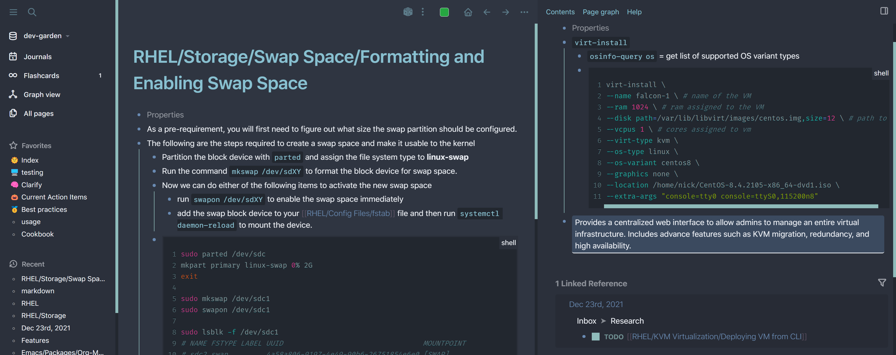
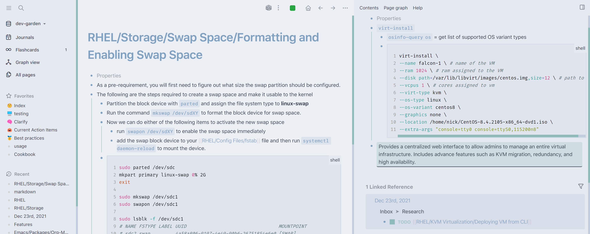

# Logseq Nord

- **Contributors:** Nick Martin (nmartin84)
- **Requires at least:** Logseq 0.5.5
- **Tested up to:** Logseq 0.5.5

## Description

NORD Theme for Logseq. 

Dark:

Light:

## Frequently Asked Questions

### How do I install the theme?
- Theme is available (pending PR) on the Logseq Market place!
  - Open Logseq, click on the 3 dots (...) top right corner, choose plugins, marketplace, themes.
  - Click install on the Logseq Nord theme.
  - Cheers. 🍻
